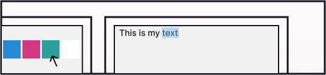

## Discord colored text generator
this is website for a generate colored text for Discord.
it works using the ANSI color codes.
[Read more](https://gist.github.com/kkrypt0nn/a02506f3712ff2d1c8ca7c9e0aed7c06)
about how it works
## source and design
[figma file](https://www.figma.com/file/ZnXqBroIiKLbvIVXJcVGYu/discord-ascii?node-id=0%3A1) -designed by [me](https://dribbble.com/hurby24)\
[source](https://gist.github.com/rebane2001/07f2d8e80df053c70a1576d27eabe97c) and [its author](https://gist.github.com/rebane2001) 
## How to use?
1.Write your text

1.Write your text

1.Write your text

